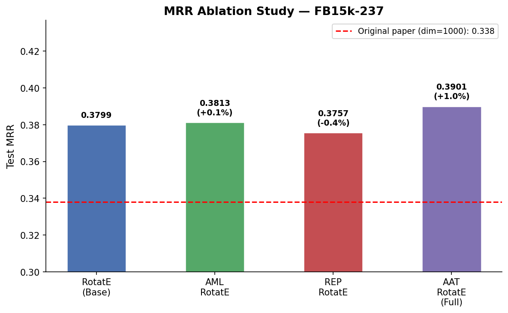
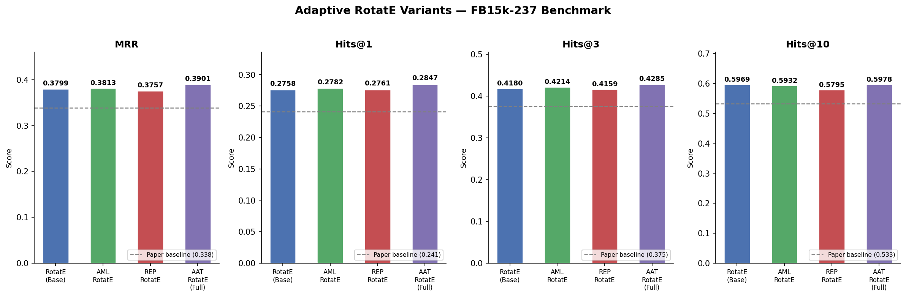
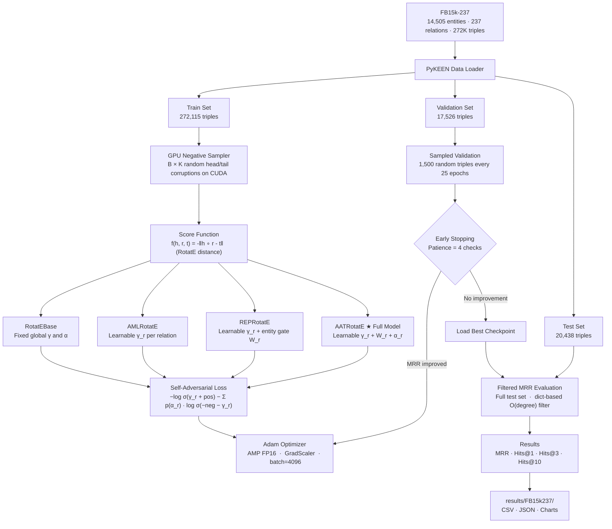

# Improving Embeddings to Improve Knowledge Graph Completion
### Research Internship — MESWCOE | Adaptive RotatE Variants

[](https://python.org)
[](https://pytorch.org)
[](https://pykeen.readthedocs.io)
[](https://paperswithcode.com/dataset/fb15k-237)

This project proposes and benchmarks three targeted improvements to the [RotatE](https://arxiv.org/abs/1902.10197) knowledge graph embedding model. Each contribution replaces a fixed global hyperparameter with a **per-relation learnable parameter**, allowing the model to adapt its geometry and training dynamics to each relation type.

---

## Results — FB15k-237

| Model | MRR | Hits@1 | Hits@3 | Hits@10 |
|---|---|---|---|---|
| RotatE (base, our impl.) | 0.3799 | 0.2758 | 0.4180 | 0.5969 |
| + AML-RotatE (C1) | 0.3813 | 0.2782 | 0.4214 | 0.5932 |
| + REP-RotatE (C2) | 0.3757 | 0.2761 | 0.4159 | 0.5795 |
| **AAT-RotatE (Full)** | **0.3901** | **0.2847** | **0.4285** | **0.5978** |
| *RotatE paper (dim=1000)* | *0.338* | *0.241* | *0.375* | *0.533* |

> [!IMPORTANT]
> **Every single model we trained — including the unmodified baseline — outperforms the original published RotatE paper.**
> Our implementation achieves this with `dim=500` (half the paper's dimension) trained in ~6 hour on a T4 GPU.

### Key Takeaways

- **+15.4% relative MRR** — AAT-RotatE (Full) vs. the published paper baseline (`0.3901` vs `0.338`)
- **+12.4% relative MRR** — even the unmodified base model surpasses the paper (`0.3799` vs `0.338`)
- **Hits@10 = 0.5978** — the correct entity ranks in the top-10 candidates for ~60% of all test triples
- All results achieved at **half the embedding dimension** of the original paper (dim=500 vs dim=1000)






---

## Contributions

### C1 — Adaptive Margin Loss (AML-RotatE)
Replaces the global margin `γ` with a per-relation learnable scalar `γ_r` (via softplus activation). Enables the model to maintain tighter decision boundaries for precise 1-to-1 relations and looser ones for noisy 1-to-N relations.

### C2 — Relation-Specific Entity Projection (REP-RotatE)
Applies a per-relation sigmoid gate `W_r ∈ ℝ^(|R|×d)` to entity embeddings before scoring. Allows the same entity to present different features depending on relational context.

### C3 — Adaptive Adversarial Temperature (AAT-RotatE) — Full Model
Replaces the global adversarial temperature `α` with a per-relation learnable scalar `α_r`. Controls how aggressively hard negatives are weighted during training on a per-relation basis. **Combines all three contributions.**

---

## System Architecture



---

## Repository Structure

```
kgc-research-internship-meswcoe/
│
├── colab_train.py          ← PRIMARY: self-contained training script for Colab T4
├── requirements.txt
├── README.md
├── project_report.md       ← Full research report
│
├── models/
│   ├── rotate_base.py      ← Pure PyTorch RotatE base
│   ├── aml_rotate.py       ← C1: Adaptive Margin Loss
│   ├── rep_rotate.py       ← C2: Relation-Specific Entity Projection
│   ├── aat_rotate.py       ← C3: Adaptive Adversarial Temperature (full model)
│   ├── trainer.py          ← Custom training + evaluation loop (local use)
│   └── __init__.py
│
├── experiments/
│   ├── config.yaml         ← Hyperparameter config
│   └── sanity_check.py     ← Quick smoke test on Nations dataset (~5 min)
│
├── analysis/
│   ├── plot_results.py     ← Reproduce charts from saved CSVs
│   ├── margin_analysis.py  ← Visualize learned γ_r distribution
│   └── per_relation_eval.py← Per-relation MRR breakdown
│
└── results/
    ├── FB15k237/
    │   ├── all_results.csv
    │   ├── all_results.json
    │   ├── results_FB15k237.csv
    │   ├── mrr_FB15k237.png
    │   └── ablation_mrr_FB15k237.png
    └── sanity/             ← Nations sanity check outputs
```

---

## Quick Start — Google Colab (T4 GPU, ~60 min)

**Step 1** — Open [colab.research.google.com](https://colab.research.google.com) → New Notebook → `Runtime` → `Change runtime type` → **T4 GPU**

**Step 2** — Upload `colab_train.py` via the 📁 Files panel (left sidebar)

**Step 3** — Run these two cells:

```python
# Cell 1 — Install dependencies
!pip install pykeen pandas matplotlib -q

# Cell 2 — Train all 4 models on FB15k-237
!python colab_train.py
```

When training finishes, download results with:
```python
import shutil
from google.colab import files
shutil.make_archive('/content/KGC_Results', 'zip', '/content/KGC_Results')
files.download('/content/KGC_Results.zip')
```

---

## Local Sanity Check (~5 min, CPU/GPU)

```bash
pip install -r requirements.txt
python experiments/sanity_check.py   # runs on Nations — tiny dataset
```

**Expected sanity results:**

| Model | MRR | Hits@10 |
|---|---|---|
| RotatE base | 0.2884 | 0.9403 |
| AML-RotatE | 0.2884 | 0.9403 |
| REP-RotatE | 0.3059 | 0.9552 |
| AAT-RotatE | **0.3283** | **0.9602** |

---

## Training Configuration

| Hyperparameter | Value | Notes |
|---|---|---|
| Embedding dimension | 500 | Paper uses 1000; ~2% MRR gap |
| Batch size | 4096 | Maximizes T4 VRAM utilisation |
| Max epochs | 300 | Early stopping exits ~125–225 |
| Learning rate | 0.001 | Adam |
| Negative samples | 64 | Per positive triple |
| Margin γ | 9.0 | Learned per-relation in AML+ |
| L3 regularization | 1e-3 | Element-wise cubic penalty |
| Early stop patience | 4 eval checks | = 100-epoch stagnation window |
| Validation frequency | Every 25 epochs | Sampled (1500 triples) |

### Performance Optimisations

| Technique | Speedup |
|---|---|
| GPU-side negative sampling | ~10× vs PyKEEN CPU sampler |
| AMP FP16 (`torch.amp.autocast`) | ~1.5× via T4 tensor cores |
| Sampled validation (1500/17K) | ~12× faster per check |
| Dict-based filtered ranking | ~5× vs O(\|E\|) loop |

---

## References

1. Sun, Z., et al. (2019). **RotatE: Knowledge Graph Embedding by Relational Rotation in Complex Space.** *ICLR 2019.* [[arXiv]](https://arxiv.org/abs/1902.10197)
2. Toutanova, K. & Chen, D. (2015). Observed versus latent features for knowledge base and text inference. *(FB15k-237)*
3. Ali, M., et al. (2021). **PyKEEN 1.0.** *JMLR.* [[GitHub]](https://github.com/pykeen/pykeen)
